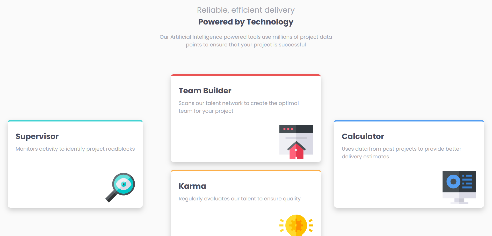
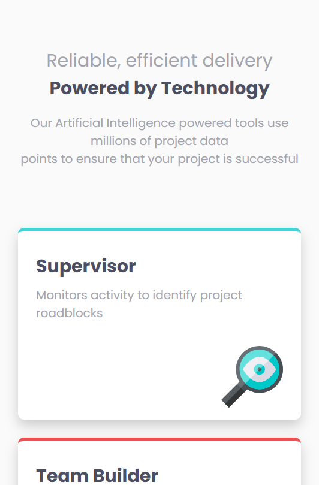

# Frontend Mentor - Four card feature section solution

This is a solution to the [Four card feature section challenge on Frontend Mentor](https://www.frontendmentor.io/challenges/four-card-feature-section-weK1eFYK). Frontend Mentor challenges help you improve your coding skills by building realistic projects.

## Table of contents

- [Overview](#overview)
  - [The challenge](#the-challenge)
  - [Screenshot](#screenshot)
  - [Links](#links)
- [My process](#my-process)
  - [Built with](#built-with)
  - [Useful resources](#useful-resources)
- [Author](#author)
- [Acknowledgments](#acknowledgments)

## Overview

### The challenge

Users should be able to:

- View the optimal layout for the site depending on their device's screen size

### Screenshot

### Links

- Solution URL: [Solution URL here](https://github.com/hazhir00/Four-Card-Feature-Section.git)
- Live Site URL: [Site URL here](https://four-card-feature-section-frontmen006.netlify.app/)

## My process

### Built with

- Semantic HTML5 markup
- CSS custom properties
- Flexbox
- Mobile-first workflow

### Useful resources

- for Flexbox
  - Flexbox Froggy
  - Learn Flexbox the easy way from Kevin Powell youtube channel

## Author

- Linkedin - [Hazhir Naseri](www.linkedin.com/in/hazhir-naseri-610091186)
- Frontend Mentor - [@hazhir00](https://www.frontendmentor.io/profile/hazhir00)
- Github - [@hazhir00](https://github.com/hazhir00)

## Acknowledgments

A heartfelt thank you to everyone who contributed free educational resources. Your efforts are truly respected.
